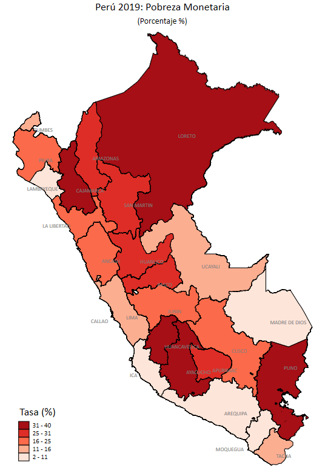
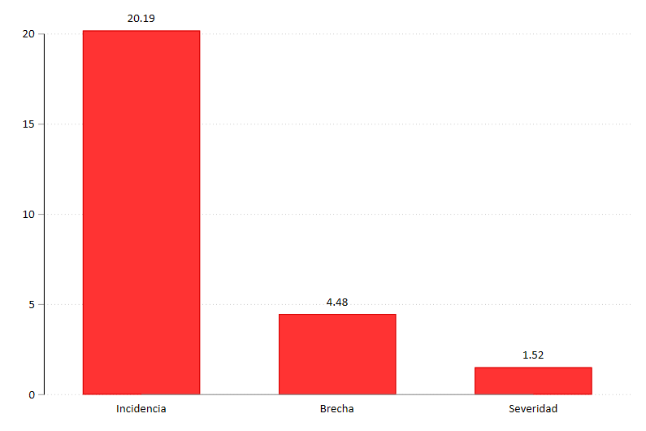
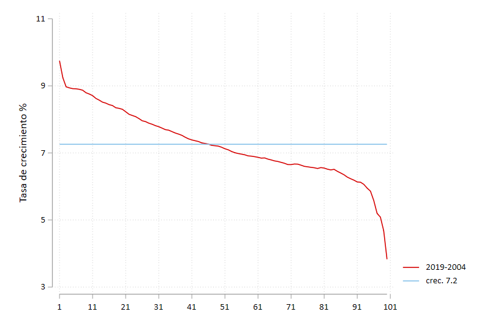
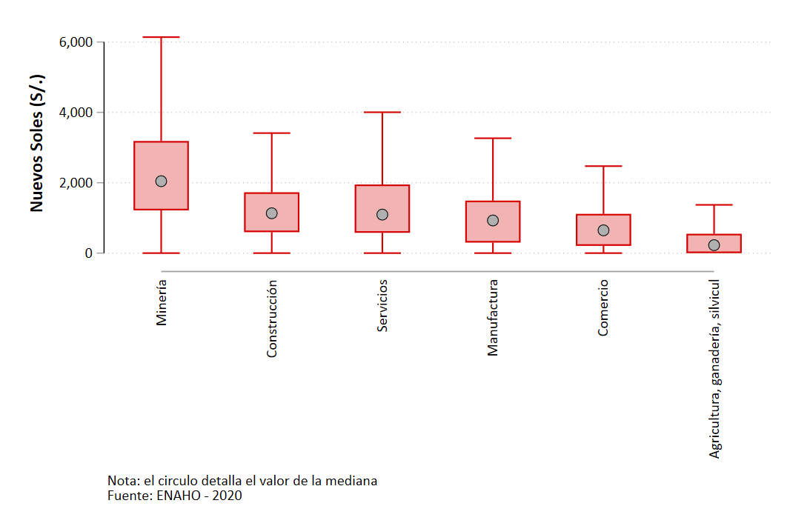
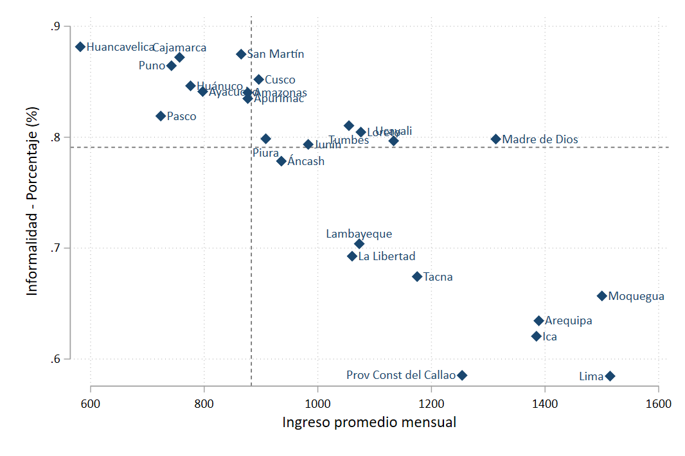
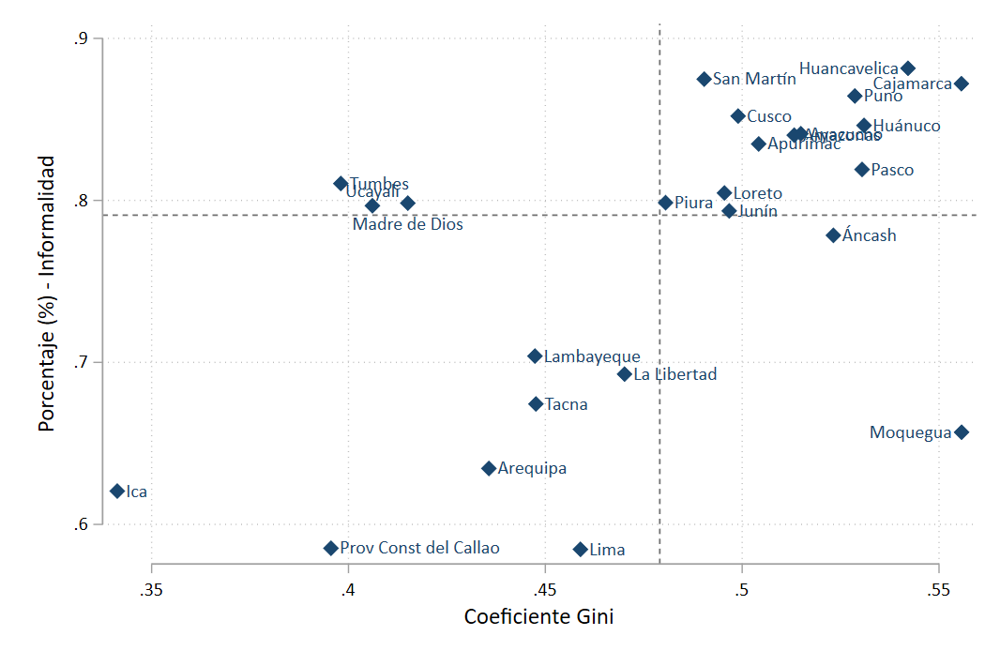

# Indicadores Pobreza
Clase de Indicadores pobreza

Figura 1: Poverty unidimensional

Figura 2: Poverty descompisition

Figure 3: Curve Growth Incidence

# Indicadores Empleo
Clase de Indicadores empleo

Figura 1: Ingresos por sector económico

Figura 2: Ingresos e Informalidad

Figura 3: Gini   e Informalidad

